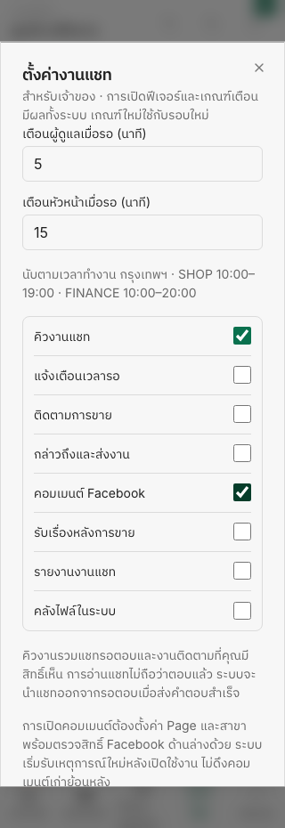
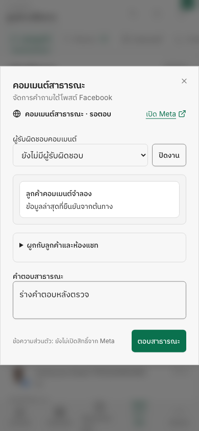

# Inbox setup and Facebook comment transport

Release: web v26.10.16. The compact communication header remains usable with the sidebar expanded or collapsed. OWNER can open work settings directly from Inbox even when the queue/comment switches are off. Settings distinguish feature activation, Page/branch binding and provider readiness.

The live Graph adapter verifies app/Page identity, expiry, granular permissions, feed subscription and post ownership. Public replies require an acknowledged provider ID; uncertain sends are never retried automatically. Existing Messenger fields and custom subscriptions are preserved from both setup entry points. Graph fetch instrumentation is excluded from Sentry to keep token query parameters out of spans and breadcrumbs.

Recovery covers failed initial reads, duplicate callbacks, missing older roots and unresolved Page echoes. Authoritative reads happen outside transactions; thread revision and current user access are checked before applying snapshots. Deleted children remain tombstoned/ambiguous without blocking verified roots; a deleted/missing root or unresolved live record still blocks replies. No schema migration, historical comment backfill or private-reply implementation is included.

## Verification

- Read-only code review completed; credential tracing, old subscription writer, recovery controls and missing-root findings fixed and reviewed again.
- Full API regression on an isolated PostgreSQL fixture: 889 suites / 11,084 tests passed; 2 suites / 14 tests skipped by the existing suite configuration.
- Final isolated chat-operations DB acceptance: 20 suites / 144 tests passed, including scope/role revocation, read retry, no replayed inbound sequence, child/root deletion, old-root recovery and concurrent webhook rejection.
- Targeted API provider/signature/telemetry tests: 5 suites / 73 tests passed.
- Final managed local check: 39 gates passed at 2026-10-06T09:06:53.470Z. Web 435 suites / 3,247 tests; shared 149 tests; storefront 46 tests; API/Web types and lint; production builds; fresh local backend; browser flows including setup at 320/1440px and signed synthetic comment recovery at 390/1440px.
- Source fingerprint: `8b85e1326eb11274a5e34de4635a35822242c0db9e773a9f25fe1ed69313d92d`.

Preview left running: http://localhost:5218/inbox. Data, AI and external-provider responses in this preview are synthetic. No real customer comment, live subscription, feature switch or Meta app setting was changed during testing. Runtime settings/permission checks are not proof of App Review approval or an observed live callback/reply. Use the [owner setup and live acceptance guide](../guides/facebook-comments-capability.md) before enabling real customer operations.

