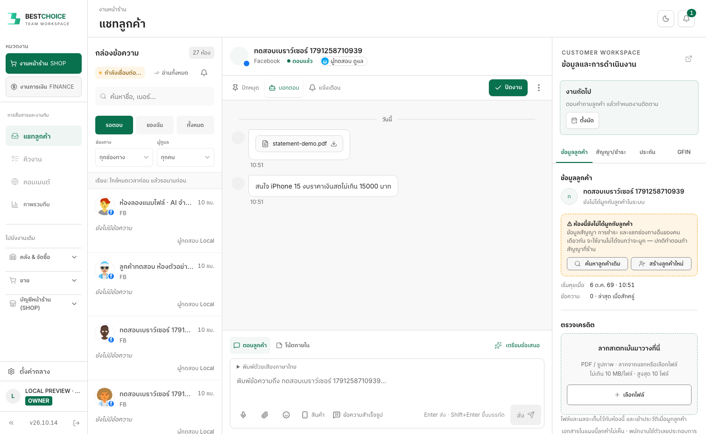
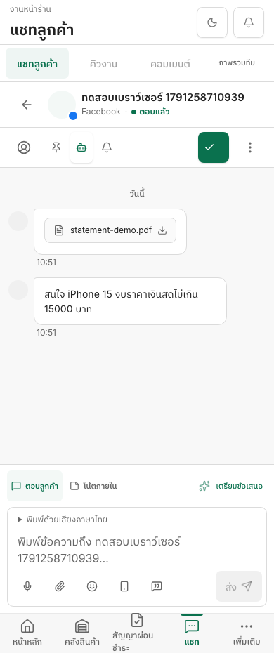
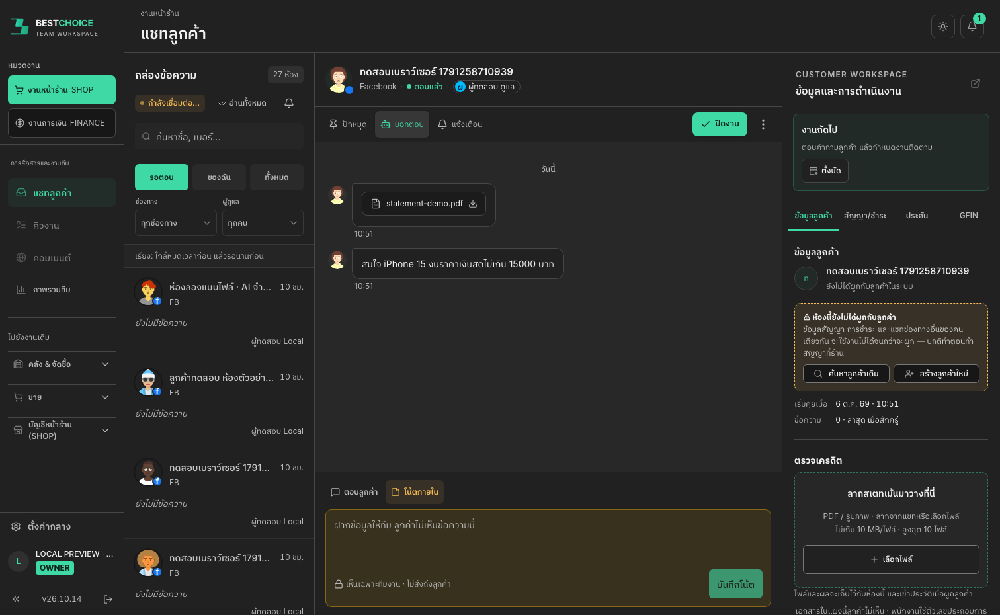

# Inbox: apply the approved V2.4 design to the actual app

The six chat features were integrated in #1682, but the rendered application still used the earlier layout. The 6 October production screenshot confirms v26.10.13 was loaded: the mismatch was implementation, not an old browser cache.

This correction applies the approved design in `docs/prototypes/chat-operations` to the real React Inbox. It uses the existing semantic colors and UI components, following UI UX Pro Max. It does not replace the app with the standalone prototype.

## Visual changes

- Inbox-specific 188px sidebar and 288px conversation column; the 330px dossier leaves the remaining space for the conversation. Existing non-Inbox navigation retains its original width and role/company grants.
- Team workspace branding, vertical work/company selection, named communication navigation and a proper page title/theme/notification header. Collapsed navigation remains available; its actions move into the page instead of disappearing.
- Clearly labelled queue, solid active view, full-width channel/owner filters, and room previews below customer identity.
- Separate identity/actions rows, neutral conversation background, white incoming bubbles and pale green outgoing bubbles. Real waiting/delivery states remain intact.
- Flat reply/note controls above one continuous composer border, offer preparation in the same row, and original voice/media/product/template controls retained.
- Dossier heading, next-work block, underlined tabs, flatter customer/credit sections and one aligned credit selection area. Broken profile images fall back to initials.
- File library uses folder/file/detail columns on wide screens and an accessible detail disclosure on phones. Existing private-byte access, staging, retries and permissions are unchanged.

## Verification

- Read-only review found a sidebar width/marker mismatch and a possible credit picker remount. Both were corrected before release. The cloud picker remains outside the room-keyed result card, so empty-to-file transitions and room changes retain its draft owner.
- Focused Web regression: **60 suites / 377 tests passed**.
- Desktop/mobile library browser check passed: folder/upload/search, keyboard selection, staged send/retry, note separation, emoji/LINE stickers, searchable products/templates, and credit copy. New regression stages a cloud file, uploads a local credit file, then verifies the staged cloud action survives.
- New browser design contract covers expanded/collapsed navigation and **feature flags off**, matching the production screenshot. It checks sidebar/header boundaries, column widths, composer mode separation, overflow and reachable Send. Light/dark, 320–1512px, 375px phone, 844×390 landscape with reduced motion, and 125% root text size passed.
- **Final managed `local:check`: PASS, 38 gates**, completed `2026-10-06T03:55:18.668Z`. Source fingerprint `c1805491e17f0189e50ce3a9660236ddbc154edd1686718fb292d46de1e9af67` (started before the implementation commit; content unchanged through completion). Includes API/Web types/lint, 434 Web suites / 3,235 tests, shared 149 tests, storefront 46 tests, builds, all six actual-app browser flows at 1440/390px, original composer checks at 320–1920px, plus the new design contract above. Preview: http://localhost:5218/inbox. Report `.tmp/local-preview/check.json`, log `/tmp/inbox-design-local-check.log`.

## Evidence and limits

Screenshots below use the actual app with synthetic customers/files and feature switches off, except library-specific verification. Different customer data and optional permissions are not copied from the mock design. New feature switches remain unchanged; this change does not enable live Facebook replies or send customer messages.

