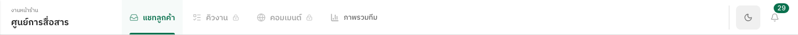
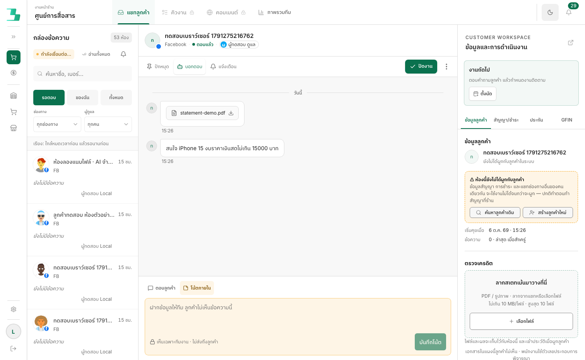
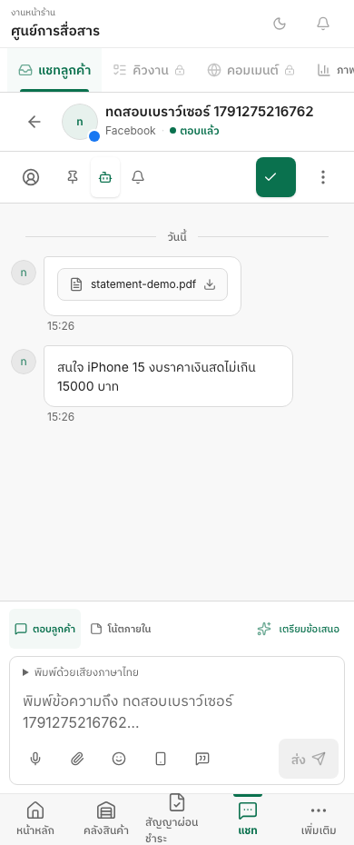
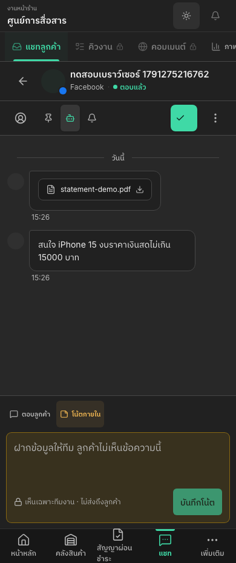

# Compact Inbox header design

The previous collapsed-sidebar layout repeated the chat title above a full-width menu, consuming two desktop rows. This revision uses a single 64px desktop bar with a distinct “ศูนย์การสื่อสาร” title, content-width navigation and an underline for the active action. Theme and work notifications sit in a separate utility area.

Expanded desktop navigation keeps its existing sidebar portal. Phones use a second, horizontally scrollable navigation row; keyboard focus brings the analytics link into view. Short landscape screens from 700px use the single-row arrangement. Existing SHOP/FINANCE company selection and feature permissions remain in their original owners.

Disabled queue/comment actions have lock icons and accessible explanations. The queue badge uses the existing scoped WAITING count; unknown/error counts are described rather than announced as zero. Notification and exact-resource target behavior remain intact.

Validation: managed `npm run local:check` passed all 38 gates, including 434 Web suites / 3,237 tests, API/Web types and lint, builds, and synthetic actual-app browser flows. Header checks cover expanded/collapsed sidebar, feature flags off, 320–1512px, light/dark, short landscape, 125% root text and keyboard reachability. Read-only review's unknown-count announcement finding was fixed and tested.

Completed: 2026-10-06T08:30:28.536Z. Preview: http://localhost:5218/inbox. Data and external-provider behavior are simulated. This revision is a local design preview; production remains unchanged.

