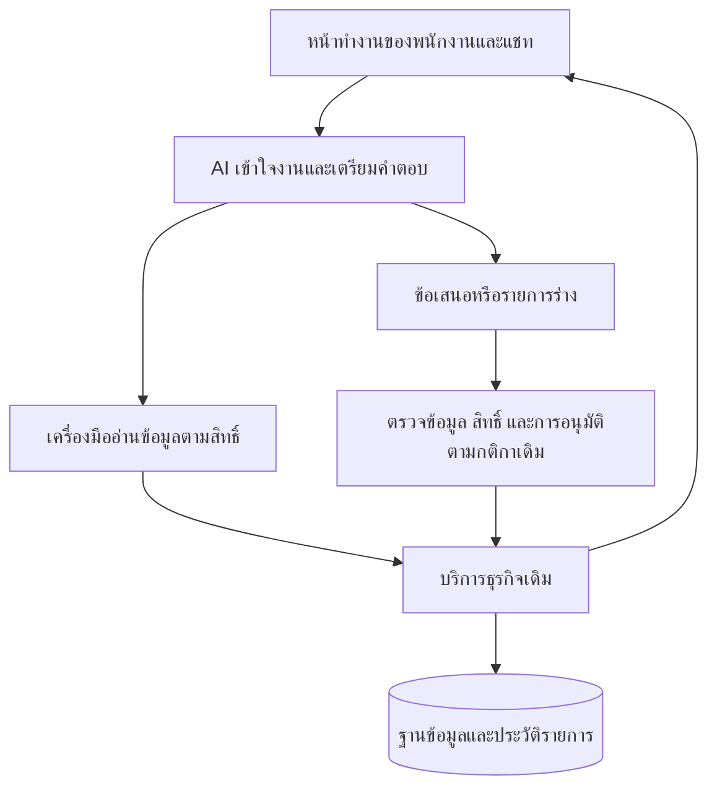

# BESTCHOICE: แผนต่อยอด AI และลดภาระดูแลโค้ด

วันที่ประเมิน: 7 กันยายน 2026

สถานะ ณ 8 กันยายน 2026: รวมงานเครดิตและทำโค้ดครบทั้ง 4 เฟส รวม OCR ภาพ/PDF, ข้อเสนอใน Inbox, การกลับมาทำสัญญา และแยกไฟล์ใหญ่แล้วใน branch `codex/ai-native-staff-experience` ดู [ผลการทำงานและหลักฐานทดสอบ](2026-09-08-ai-native-implementation.md) งานอยู่ใน [PR #1539](https://github.com/iamnaii/BESTCHOICE/pull/1539) การทดลองกับพนักงานจริงและสถานะ production แยกบันทึกจากผลตรวจ local

เนื้อหาด้านล่างเป็นแผนและข้อมูลฐาน ณ วันที่ประเมินเดิม ผลวัดหลังปรับอยู่ในรายงานที่ลิงก์ไว้

## ข้อเสนอหลัก

ต่อยอดให้ AI เข้าใจงานของพนักงาน ดึงข้อมูลที่เกี่ยวข้อง และเรียกใช้บริการธุรกิจเดิมผ่านเครื่องมือที่มีขอบเขตชัดเจน พร้อมลดโค้ดเชื่อมต่อ AI และกฎธุรกิจที่มีสำเนาหลายจุด

สำหรับ BESTCHOICE คำว่า AI native ควรหมายถึง AI อยู่ในขั้นตอนทำงาน เช่น สรุปห้องแชท แนะนำสินค้าจากสต็อกจริง คำนวณข้อเสนอผ่านเครื่องคิดกลาง และเตรียมข้อมูลให้พนักงานตรวจ ไม่จำเป็นต้องเปลี่ยนทุกหน้าเป็นแชท

ความถูกต้องของยอดเงิน การลงบัญชี สถานะสัญญา การอนุมัติ และสิทธิ์ของผู้ใช้ต้องตรวจด้วยโค้ดที่ให้ผลแน่นอน AI เรียกใช้บริการเหล่านี้ได้ แต่ไม่เป็นผู้กำหนดสูตรหรือข้ามเงื่อนไขธุรกิจ

## สิ่งที่มีอยู่แล้ว

| ฐานเดิม | หลักฐานใน repository | วิธีต่อยอด |
| --- | --- | --- |
| บอทขายเรียกเครื่องมือ 9 ตัว และจำกัดรอบการเรียก | `apps/api/src/modules/sales-bot/sales-bot.service.ts`, `sales-bot.module.ts` | ใช้เป็นต้นแบบการเชื่อม AI กับบริการธุรกิจ |
| Interface กลางสำหรับ Claude/Gemini | `apps/api/src/modules/sales-bot/providers/llm-provider.interface.ts` | แยกส่วนกลางออกมาเมื่อมีผู้ใช้จริงหลายกลุ่ม โดยรักษา config เฉพาะ SHOP |
| สรุปแชท ปรับน้ำเสียง และแนะนำคำตอบ | `apps/api/src/modules/staff-chat/services/ai-assistant.service.ts`, `ai-suggest.service.ts` | เป็นงานนำร่องสำหรับรวมการเรียกโมเดล |
| บันทึกการใช้ AI และตรวจงบ | `apps/api/src/modules/ai-usage/` | ใช้ข้อมูลเดิมต่อ เพิ่มความสม่ำเสมอในการบันทึกแต่ละคำขอ |
| พนักงานรับช่วงและส่งคืนให้ AI | `apps/api/src/modules/chat-ai-draft/chat-ai-draft.service.ts` | รักษาพฤติกรรมเดิม ชื่อโมดูลนี้ไม่ได้แปลว่ายังมีระบบสร้าง draft เก่าทำงานอยู่ |
| ค้นฐานความรู้และ feedback | `sales-bot/tools/search-knowledge-base.tool.ts`, `staff-chat/services/ai-training.service.ts` ภายใต้ `apps/api/src/modules/` | ปรับคุณภาพจากกรณีจริงที่ลบข้อมูลส่วนบุคคลแล้ว |
| แบ่ง frontend เป็น chunks และ lazy routes | `apps/web/vite.config.ts`, `apps/web/src/App.tsx` | ตรวจ import ที่ดึงหน้าจอกลับเข้ามาโหลดล่วงหน้า |

## จุดลดความซับซ้อนที่พบจริง

### 1. รวมส่วนเชื่อมต่อ AI เริ่มจากงานข้อความ

`AiAssistantService` สร้าง Anthropic client เอง เรียกโมเดล และบันทึก usage ขณะที่ `AiSuggestService` และบริการ AI อื่นมีส่วนจัดการคำขอและ usage ของตัวเอง จึงควรแยก client/config, การเรียกโมเดล, การอ่าน token usage และการจัดการข้อผิดพลาดร่วมกัน โดยเก็บ prompt และกติกาของงานไว้ในบริการเดิม

ข้อกำหนดการย้าย:

- งานนำร่อง: สรุปบทสนทนา ปรับน้ำเสียง และเสนอคำตอบใน staff-chat
- รักษา model, prompt, token limit, รูปแบบผลลัพธ์ และ fallback เดิม เพื่อแยกผลของการ refactor ออกจากการเปลี่ยนคุณภาพโมเดล
- ระบุชื่อ use case และข้อมูลผู้เรียกจากฝั่ง server บันทึก usage หนึ่งครั้งต่อคำขอโมเดล
- กำหนด timeout และวิธีบันทึก usage ให้ชัด ปัจจุบัน sales-bot รอการบันทึก แต่บางบริการใช้ `void` ซึ่งควรตรวจพฤติกรรมในสภาพแวดล้อม deploy
- Registry ปัจจุบันอ่าน `shop_bot_llm_provider` จึงไม่ควรนำ config นี้ไปควบคุม FINANCE หรือ OCR โดยอัตโนมัติ
- Interface ปัจจุบันรองรับข้อความเป็น string งานรูปภาพ/PDF ต้องออกแบบ capability เพิ่มก่อนย้าย

ผลที่คาดหวัง: การเปลี่ยนวิธีเชื่อมต่อและวัดค่าใช้จ่ายแก้ที่ส่วนกลางได้ ขนาดโค้ดสุทธิต้องนับหลังย้ายและลบส่วนเดิม การเพิ่ม wrapper อย่างเดียวไม่ถือว่าลดโค้ดสำเร็จ

### 2. รวมเครื่องคิดค่างวดที่มีสำเนาตรงกัน

ตรวจเทียบเนื้อหาแล้วพบไฟล์เหมือนกันทุกตัวอักษรสองคู่:

- `packages/shared/src/installment-calc.ts` กับ `apps/api/src/utils/installment-calc.util.ts`: 150 บรรทัดต่อไฟล์
- `packages/shared/src/installment-calc.types.ts` กับ `apps/api/src/utils/installment-calc.types.ts`: 99 บรรทัดต่อไฟล์

ให้ `packages/shared` เป็นแหล่งสูตรกลาง แล้วเปลี่ยน API ให้ใช้ implementation เดียวกัน บอทขายเรียกสำเนาฝั่ง API อยู่ผ่าน `apps/api/src/modules/sales-bot/tools/calculate-installment.tool.ts` จึงเป็นจุดที่การลดสำเนาช่วยป้องกันผลคำนวณของ AI กับหน้าจอคลาดเคลื่อนในอนาคต

ต้องตรวจเส้นทาง build/runtime ก่อน: `packages/shared/package.json` ส่งออก source TypeScript ผ่าน `main` ปัจจุบัน การเปลี่ยน import อย่างเดียวอาจไม่เพียงพอสำหรับ NestJS ที่รันจากไฟล์ JavaScript หลัง build ใช้ชุดทดสอบสูตรเดิมทั้ง API/shared และตรวจ output หลัง build ก่อนย้ายจริง

### 3. แก้การโหลดหน้าตั้งค่าผ่านเมนูค้นหา

พบเส้นทาง static import:

`App.tsx` → `MainLayout.tsx` → `components/CommandPalette.tsx` → `config/settings-registry.tsx` → หน้าตั้งค่าหลายหน้า

`settings-registry.tsx` ผูกข้อมูลเมนูกับ component ที่ import แบบ static ขณะที่ Command Palette ต้องการเพียงชื่อ เส้นทาง และสิทธิ์ จึงมีโอกาสดึงโค้ดหน้าตั้งค่าเข้าสู่ dependency graph ของแอปตั้งแต่เริ่ม

แยกข้อมูลเมนูออกจากการโหลด component หรือใช้ lazy component ภายใน registry เดิม โดยรักษาชื่อ route, role และรายการเมนู ใช้ build output และ network ของการเปิด Dashboard เพื่อยืนยันว่าหน้าตั้งค่าถูกโหลดเมื่อเข้าใช้งานจริง

ข้อค้นพบนี้เป็นหลักฐานจาก import graph ยังไม่ได้วัดจำนวน KB หรือเวลาที่ลดได้ และ `manualChunks` ที่มีอยู่ไม่ได้ยืนยันด้วยตัวมันเองว่า chunk จะถูกโหลดเมื่อจำเป็นเท่านั้น

### 4. แยกความรับผิดชอบในหน้าจอขนาดใหญ่ตามงานจริง

ตัวอย่างที่ควรตรวจต่อคือ `apps/web/src/pages/PaymentsPage/components/RecordPaymentWizard.tsx` ประมาณ 1,991 บรรทัด และ `apps/web/src/pages/UnifiedInboxPage/components/Customer360Panel.tsx` ประมาณ 1,758 บรรทัด

แยกการดึงข้อมูล การคำนวณ state และการแสดงผลตามขอบเขตที่มีอยู่ ใช้ hook/component เดิมก่อนสร้างเพิ่ม การแยกไฟล์ช่วยอ่านและทดสอบ แต่จะลดจำนวนโค้ดได้ต่อเมื่อกำจัดส่วนซ้ำด้วย ไม่ควรสร้างระบบฟอร์มกลางครอบทุกกรณีโดยยังไม่มีกรณีใช้งานร่วมที่ชัดเจน

## รูปแบบการทำงานเป้าหมาย

ตัวอย่างเป้าหมาย: พนักงานเปิดแชทแล้วขอ “สรุปลูกค้าคนนี้ และเตรียมตัวเลือกมือถือจากงบที่แจ้ง” AI อ่านเฉพาะข้อมูลที่พนักงานมีสิทธิ์ ค้นสต็อกจริง เรียกเครื่องคิดกลาง และแสดงตัวเลือกพร้อมข้อมูลอ้างอิงให้ตรวจได้ การบันทึกขายหรือออกสัญญาใช้บริการและกระบวนการอนุมัติเดิม

เมื่อขยายเครื่องมือไปยังงานพนักงาน ต้องส่งตัวตนและขอบเขตบริษัท/สาขาจาก session ของ server การเรียก service โดยตรงไม่ได้ผ่าน controller guards โดยอัตโนมัติ จึงต้องตรวจสิทธิ์ที่ขอบเขตเครื่องมือหรือบริการด้วย

## การใช้งานสำหรับพนักงานใหม่

เพิ่มเติมตามคำถามเรื่อง user friendly: ควรปรับให้พนักงานเห็นว่าจะเริ่มงานตรงไหน และต้องทำอะไรต่อ ระบบปัจจุบันมีพื้นฐานที่ดี แต่ยังมีบางจุดที่อาศัยความคุ้นเคยกับเมนูและขั้นตอนธุรกิจ ข้อประเมินนี้มาจากโครงสร้างและข้อความใน source ยังไม่ได้ตรวจหน้าจอที่ render จริงหรือทดสอบกับพนักงานใหม่ จึงยังสรุปไม่ได้ว่าคนใหม่ใช้งานได้ง่ายแล้ว

### สิ่งที่ควรใช้ต่อ

- เมนูแยกตามบทบาทและโซนงาน มีชื่อภาษาไทยและเมนูมือถืออยู่แล้ว: `apps/web/src/config/menu.ts`, `apps/web/src/components/layout/Sidebar.tsx`
- สร้างสัญญาแบ่ง 3 ขั้น: เลือกสินค้า → เลือกลูกค้า → เลือกแผนผ่อน + ยืนยัน พร้อมแสดงขั้นปัจจุบัน: `apps/web/src/pages/ContractCreatePage/constants.ts`, `apps/web/src/pages/ContractCreatePage/components/StepIndicator.tsx`
- มีค้นหากลางและปุ่มเริ่มงานลัด: `apps/web/src/components/CommandPalette.tsx`
- มี component กลางสำหรับหัวข้อหน้า ข้อผิดพลาด และหน้าที่ยังไม่มีข้อมูล สามารถเพิ่มคำอธิบายและปุ่มทำต่อจากของเดิมได้

### จุดที่ควรปรับก่อน

| สิ่งที่พบใน source | สิ่งที่คนใหม่อาจติด | ข้อเสนอ |
| --- | --- | --- |
| เมนู SALES มี 18 รายการใน 3 หมวด | ต้องเลือกเมนูเองก่อนรู้ว่างานหนึ่งเริ่มตรงไหน | เพิ่มส่วน “เริ่มงาน” บนหน้าแรก เลือกแสดงงานหลัก 4 งานตาม role โดยเมนูเต็มยังเปิดหาได้ |
| หน้าแรก SALES เน้นยอดขายและค่าคอมมิชชันใน `DashboardMySales`; ส่วน shortcuts ของ `DashboardRevenue` แสดงให้ role อื่น | เห็นผลสรุป แต่ยังต้องค้นทางเริ่มทำงาน | วางปุ่มเริ่มงานและรายการที่ต้องทำต่อไว้ก่อนสรุปยอดของพนักงาน |
| งานเดียวกันใช้ “ขายของ (POS)” / “POS ขายสินค้า” / “POS” ใน sidebar / ค้นหา / top bar และมีคำว่า “CRM Pipeline” | ต้องเรียนรู้ว่าคำไหนหมายถึงงานเดียวกัน | ใช้ชื่อไทยหลักร่วมกัน เช่น “ขายสินค้า”, “ติดตามลูกค้า” โดยเก็บคำเดิมเป็นคำค้นหรือคำประกอบ |
| กรณีลูกค้ายังไม่มีผลตรวจเครดิตใน `CustomerSelectStep.tsx` ปุ่มไป `/credit-checks` โดย URL ไม่ส่งลูกค้าหรือจุดกลับ | อาจต้องเลือกลูกค้าและหาทางกลับมาทำสัญญาต่อเอง | ตรวจการเก็บ draft/บริบทที่มีอยู่ แล้วส่งต่อลูกค้าและเพิ่มทาง “กลับไปทำสัญญาต่อ” ให้ครบวงจร |

ลำดับข้อมูลบนหน้าแรกที่เสนอสำหรับพนักงานขาย:

1. ชื่อพนักงานและสาขาที่กำลังทำงาน
2. “เริ่มงาน”: **ขายสินค้า / ทำสัญญาผ่อน / รับชำระค่างวด / ตอบแชทลูกค้า** — แต่ละปุ่มมีคำอธิบายหนึ่งบรรทัดและไปยัง flow เดิมตามสิทธิ์
3. “งานที่ต้องทำต่อ”: แสดงเฉพาะงานของตนที่มีข้อมูลรองรับ พร้อมบอกเหตุผลที่รอและปุ่มทำต่อ
4. ยอดขายและค่าคอมมิชชันเดิม

ชุดงานทั้ง 4 เป็นข้อเสนอเริ่มต้น ต้องตรวจความถี่งานกับพนักงานจริงก่อนสรุปลำดับ ส่วนงานการเงิน/บัญชีใช้รายการที่ตรงกับหน้าที่ของตน ไม่เพิ่มงานที่ผู้ใช้ไม่มีสิทธิ์

### AI ที่ช่วยให้คนใหม่เข้าใจง่าย

- ใช้ปุ่มที่สื่อผลลัพธ์ เช่น “สรุปแชท”, “ช่วยตรวจข้อมูลที่ยังขาด”, “เตรียมคำตอบ” โดยต่อจาก AI ใน Inbox เดิม
- แสดงสถานะด้วยข้อความชัดเจน เช่น “AI กำลังอ่านเอกสาร”, “AI เตรียมร่างแล้ว — รอตรวจสอบ”, “บันทึกสำเร็จ” แยกร่างกับรายการที่เกิดขึ้นจริงให้เห็น
- เมื่อทำต่อไม่ได้ ให้อธิบายสิ่งที่ขาดและวิธีแก้ใกล้ปุ่ม เช่น “ต้องเลือกลูกค้าก่อน” หรือ “รอผู้จัดการตรวจเครดิต” ใช้เงื่อนไขเดียวกับ validation เดิม
- เพิ่มคำแนะนำสั้นตามหน้าที่กำลังใช้งาน เปิดดูซ้ำและปิดได้ คนที่ชำนาญยังใช้ปุ่มและคีย์ลัดเดิมได้

หลักการใช้คำที่ผู้ใช้คุ้นเคย แสดงสถานะ และช่วยให้เห็นทางเลือกโดยไม่ต้องจำขั้นตอน สอดคล้องกับ [10 Usability Heuristics ของ Nielsen Norman Group](https://www.nngroup.com/articles/ten-usability-heuristics/) ข้อเสนอหน้าจอและลำดับงานในส่วนนี้เป็นการประเมิน BESTCHOICE จาก source

### ทำให้ใช้ง่ายพร้อมลดโค้ด

ใช้ข้อมูลชื่อเมนู เส้นทาง สิทธิ์ และคำค้นจากแหล่งกลางร่วมกับงานแยก settings metadata ในแผนเดิม; ใช้ PageHeader, EmptyState และ StepIndicator ที่มีอยู่ เพิ่มคำแนะนำใน flow เดิม หลีกเลี่ยงการทำแอปสำหรับคนใหม่อีกชุดซึ่งจะเพิ่มภาระดูแล

เริ่มด้วยต้นแบบหน้าแรก SALES และการไปตรวจเครดิตแล้วกลับมาทำสัญญาต่อ ทดสอบกับพนักงานใหม่หรือคนที่ยังไม่เคยใช้ระบบ 3–5 คนในข้อมูลทดสอบ โดยให้ลองค้นลูกค้า เริ่มขายสินค้า และทำสัญญาจนถึงหน้าตรวจทาน ผู้สังเกตไม่ชี้ตำแหน่งปุ่มระหว่างทำงาน

เก็บเวลาจนเริ่มงานถูก จำนวนครั้งที่ต้องถามหรือย้อนกลับ งานที่ทำสำเร็จ และจุดที่กรอกผิด เทียบก่อนและหลังด้วยสถานการณ์ที่มีความยากใกล้เคียงกัน โดยสลับลำดับทดสอบเพื่อลดผลจากการจำขั้นตอน กลุ่มเล็กนี้ใช้ค้นหาปัญหาเบื้องต้น ไม่ใช่หลักฐานทางสถิติว่าพนักงานทุกคนจะใช้ได้ง่าย

เกณฑ์ตัดสินก่อนปรับจริง: คนใหม่หาเส้นทางเริ่มงานได้โดยไม่ต้องบอกชื่อเมนู รู้ว่าติดอะไรและทำต่ออย่างไร แยกผล AI ที่เป็นร่างกับผลบันทึกได้ และพนักงานเดิมยังทำงานด้วยเส้นทางเดิมได้

## ลำดับงานและเกณฑ์รับงาน

ทำ UX ต้นแบบและเก็บ baseline พนักงานใหม่ควบคู่กับงานข้อ 1–2 ด้านล่าง แล้วใช้ผลทดสอบกำหนดรายละเอียด workflow ในข้อ 4

| ลำดับ | งาน | หลักฐานที่ต้องได้ |
| --- | --- | --- |
| 1 | แก้ import ของ settings โดยใช้ registry เดิม | เมนู/สิทธิ์/route เดิมทำงาน, build ผ่าน, เปรียบเทียบ JS ที่โหลดครั้งแรกก่อนและหลัง |
| 2 | รวมการเรียก AI สำหรับ staff-chat แบบข้อความ | ชุดทดสอบเดิมผ่าน, fallback เดิม, usage ไม่ซ้ำ, เปรียบเทียบคุณภาพ/เวลา/ค่าใช้จ่ายจากกรณีเดียวกัน |
| 3 | รวมสูตรค่างวดเข้าที่ shared | ชุดทดสอบสูตรเดิมผ่าน, API ที่ build แล้วรันได้, ทุก caller ใช้แหล่งสูตรเดียว |
| 4 | ต่อ workflow พนักงานหนึ่งงานใน Inbox เดิม | งานสำเร็จโดยคลิกน้อยลง, ข้อมูลตรวจสอบที่มาได้, สิทธิ์และการรับช่วงของพนักงานทำงาน |

แต่ละงานควรจบเป็นการเปลี่ยนแปลงขนาดเล็กที่ทดสอบและย้อนกลับได้ งานที่ 2 และ 3 ย้ายผู้ใช้จริงพร้อมเลิกใช้สำเนาเดิม ไม่ทิ้งระบบกลางใหม่ไว้ควบคู่กับ implementation เดิมโดยไม่มีแผนเลิกใช้

## ข้อมูลฐานและข้อจำกัดของการประเมิน

นับจากไฟล์ `.ts`, `.tsx`, `.js`, `.jsx`, `.mjs` ใต้ source roots ด้านล่าง แยกไฟล์ชื่อ `.test.` / `.spec.` และโฟลเดอร์ `__tests__` ออก ไม่นับโฟลเดอร์ generated, node_modules, dist, coverage ตัวเลขเป็นบรรทัดกายภาพ รวม comment, บรรทัดว่าง, declaration และข้อมูลตาราง จึงไม่ใช่จำนวนบรรทัด logic หรือหลักฐานความช้า

| Source root | ไฟล์ที่ไม่จัดเป็น test | บรรทัดกายภาพ |
| --- | ---: | ---: |
| `apps/api/src` | 1,399 | 214,237 |
| `apps/web/src` | 912 | 201,401 |
| `apps/web-shop/src` | 131 | 12,337 |
| `packages/shared/src` | 6 | 727 |

Working tree มีงานแก้ไขอื่นอยู่ระหว่างทำ ตัวเลขนี้เป็น snapshot ในเครื่อง ไม่ใช่โค้ด production ที่ยืนยันแล้ว เอกสาร architecture เก่าระบุจำนวนโมดูลและเวอร์ชันต่ำกว่าสภาพไฟล์ปัจจุบัน จึงใช้ source/package manifests เป็นหลัก

รอบนี้ตรวจ source, import graph และเทียบไฟล์ที่ซ้ำ ยังไม่ได้รัน build, test suite, เรียกโมเดล หรือเก็บ runtime profile จึงยังไม่กำหนดเปอร์เซ็นต์ลดโค้ด ความเร็ว หรือค่าใช้จ่ายที่รับประกันได้

วัดผลแยกสามด้าน: (1) สำเนา logic และจำนวนจุดที่ต้องแก้เมื่อเปลี่ยนพฤติกรรม (2) ขนาด JavaScript ที่โหลดจริง เวลาเปิดหน้าจอ และทรัพยากรของ API (3) อัตรางาน AI สำเร็จ การแก้คำตอบโดยพนักงาน ค่าใช้จ่ายต่องาน และเวลา p95 การเพิ่ม AI อาจเพิ่ม latency/ค่าใช้จ่าย แม้ทำให้พนักงานทำงานเสร็จเร็วขึ้น

แนวทางเริ่มจากองค์ประกอบที่เรียบง่ายและเพิ่มความซับซ้อนเมื่อมีผลวัดรองรับ สอดคล้องกับหลักการใน [Building effective agents ของ Anthropic](https://www.anthropic.com/engineering/building-effective-agents) ส่วนรายการเปลี่ยนแปลงข้างต้นเป็นข้อเสนอที่ได้จากโค้ด BESTCHOICE โดยตรง
