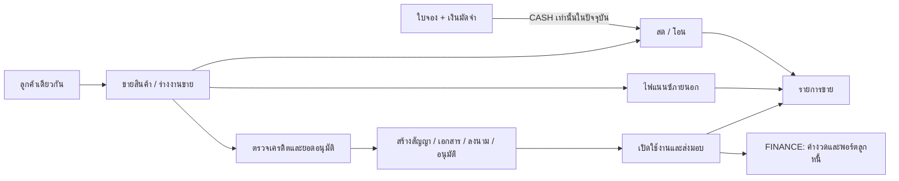

# BESTCHOICE — ตรวจหมวดขายและข้อเสนอ UX/UI

ตรวจวันที่ 11 กันยายน 2569 · checkout `/Users/iamnaii/Desktop/App/BESTCHOICE` · branch `fix/lifecycle-spec-self-approval` · revision `dce7ae705`

**อัปเดตหลัง `/scrutinize`:** อ่าน [ผลตรวจซ้ำรอบสอง](scrutinize.md) ควบคู่กัน พบความต่างของยอดผ่อน frontend/API, ข้อมูลที่รั่วผ่านใบขายรายใบ, เส้นทางสร้างสัญญาสองชุด และการบันทึกเงินรับที่ต้องแก้เพิ่ม ข้อเสนอรวม flow ด้านล่างเป็นแนวคิดระยะถัดไป; ระยะแรกควรคงเมนูและ wizard เดิมแล้วแก้ความถูกต้อง/ส่งต่อข้อมูลก่อน

**ข้อสรุป: ควรแก้ความถูกต้องของข้อมูลและการส่งต่องานก่อน จากนั้นรวมจุดเริ่มขายและส่วนประกอบที่ซ้ำกัน โดยยังคงหน้าลูกค้า เครดิต ใบจอง สัญญา และรายการขายตามหน้าที่ของแต่ละงาน** ไม่จำเป็นต้องรื้อสีหรือธีมทั้งระบบ

- [เปิดต้นแบบแนวคิดระยะถัดไป 6 เมนู](http://localhost:5211/prototype.html) — คลิกเมนู เปลี่ยนประเภทการขาย เปิดรายละเอียด และลองส่งต่อไปทำสัญญาได้; ยังไม่ใช่สเปกที่ต่อ API ปัจจุบันได้ครบ
- [ไฟล์ต้นแบบ](prototype.html) · [ตัวอย่างหน้าขาย](proposal-sale-1440.png) · [ตัวอย่างบนมือถือ](proposal-sale-390.png)
- [ภาพหน้าจอปัจจุบันและขอบเขตที่ตรวจ](coverage.md)
- รอบนี้เป็นการตรวจและทำข้อเสนอ **ไม่ได้แก้ application code, schema, ข้อมูลใช้งานจริง หรือ deploy**

## ขอบเขตและวิธีอ่านผล

ตรวจ menu/routing, React pages และ components ที่เกี่ยวข้อง, API controller/service/DTO, สิทธิ์, query/cache, การคำนวณ, การแบ่งหน้า, การส่งออก และ UI ที่ 1440px กับ 390px ครบ 6 เมนูหลัก รวมหน้าลูกค้ารายบุคคลและแท็บย่อย ฟอร์มเพิ่มลูกค้า/เครดิต หน้าสร้างสัญญา รายละเอียดสัญญา และขั้นตอนลงนาม

เปิด app จาก checkout นี้ที่ `http://localhost:5207` ด้วยฐานข้อมูลทดสอบแยกและ AI จำลอง ส่วน Bookings, Sales, รายการสัญญา และเอกสารลงนามบาง endpoint ยังไม่รองรับใน preview จึงใช้ browser response fixtures เพื่อเปิดตรวจหน้าตาจาก React code จริง **ภาพเหล่านี้พิสูจน์ UI ไม่ได้พิสูจน์ธุรกรรม API หรือยอดเงินจริง**

คำว่า **ยืนยันจากโค้ด** หมายถึงพบเส้นทางเรียกครบ frontend → controller → service หรือทำซ้ำเมธอดจริงด้วย dependency จำลองแล้ว ส่วนข้อกังวลเรื่องการแข่งขันพร้อมกันระบุแยกเป็น **ต้องทดสอบเพิ่ม** ไม่มีการทดลองโจมตี production หรือใช้ข้อมูลลูกค้าจริง

## ปัญหาที่ควรแก้ก่อน

### F01 · P1 — ยอดขายไม่บังคับสาขาของพนักงานเมื่อไม่ส่ง branchId

`SalesController.findAll` ส่งเฉพาะ `branchId` จาก query และ `userRole`; ไม่ส่งสาขาของผู้ใช้ไปจำกัดข้อมูล ขณะที่ `BranchGuard` ยอมผ่านเมื่อไม่มี `branchId` และให้ service จำกัดต่อ แต่ `SalesQueryService` จำกัดสาขาเฉพาะเมื่อมี filter เท่านั้น `GET /sales/:id` ก็ไม่มี user context ให้ตรวจเจ้าของสาขา

ผล: ผู้ใช้ SALES/BM ที่เรียก list โดยไม่กำหนดสาขาไม่มี branch predicate ใน query; ไม่ควรพึ่งการซ่อนตัวกรองใน UI การอ่านข้ามบริษัทเป็นอีกมิติหนึ่งและยังไม่ได้รับรองว่าปลอดภัยทุก endpoint

หลักฐานทำซ้ำ: guard ยอมผ่าน SALES สาขา A → controller ส่ง `branchId: undefined` → query เป็น `{ deletedAt: null }` ทดสอบด้วย service/controller จริงและ Prisma mock ไม่ได้ทดสอบโจมตีผ่าน production HTTP

แก้: ใช้ `getBranchScope(user)` ฝั่ง API สำหรับ list/detail/summary/export; ผู้ใช้ไม่มีสาขาต้องปฏิเสธหรือคืนว่างตาม policy ที่กำหนด เพิ่ม tests สำหรับ SALES/BM/OWNER/FM/ACCOUNTANT ทั้งระบุและไม่ระบุสาขา

อ้างอิง: [apps/api/src/modules/sales/sales.controller.ts:25](/Users/iamnaii/Desktop/App/BESTCHOICE/apps/api/src/modules/sales/sales.controller.ts:25) · [apps/api/src/modules/sales/services/sales-query.service.ts:27](/Users/iamnaii/Desktop/App/BESTCHOICE/apps/api/src/modules/sales/services/sales-query.service.ts:27) · [apps/api/src/modules/auth/guards/branch.guard.ts:40](/Users/iamnaii/Desktop/App/BESTCHOICE/apps/api/src/modules/auth/guards/branch.guard.ts:40)

### F02 · P1 — API ใบจองแก้ยอดมัดจำที่รับแล้วได้โดยไม่ปรับรายการเงิน

`BookingsService.update` อนุญาตทั้ง `PENDING_DEPOSIT` และ `PAID` แล้วแก้ `depositAmount`, ลูกค้า, สาขา และรายการสินค้าได้ แต่ไม่มี refund/adjustment journal ในเส้นทางนี้ อีกกรณีแก้เฉพาะรายการให้ยอดรวมลดลง จะไม่ตรวจว่ามัดจำเดิมเกินยอดรวมใหม่หรือไม่

ทำซ้ำเมธอดจริงด้วย mock: ใบ PAID มัดจำ 1,000 → แก้เป็น 2,000 สำเร็จและจำนวนการเรียก journal = 0; เปลี่ยนรายการรวมเหลือ 500 โดยไม่ส่งมัดจำ → ได้ total 500 / deposit 1,000 หน้าปัจจุบันยังไม่มีปุ่มแก้ใบจอง จึงเป็นปัญหา API และเป็นด่านที่ต้องแก้ก่อนเพิ่ม UI แก้ไข

แก้: ล็อกมูลค่าที่รับเงินจริงหลังรับเงิน หรือเปลี่ยนผ่านคำสั่งปรับยอดที่มีเหตุผลและรายการบัญชีคู่กัน; ตรวจ deposit ≤ total ทุกครั้ง; จำกัดสถานะใน write ภายใน transaction ไม่ใช่ตรวจนอก transaction อย่างเดียว

อ้างอิง: [apps/api/src/modules/bookings/bookings.service.ts:334](/Users/iamnaii/Desktop/App/BESTCHOICE/apps/api/src/modules/bookings/bookings.service.ts:334)

### F03 · P1 — สร้างใบจองผ่าน UI แล้วแปลงขายต่อไม่ได้

`DraftItem` มี `productId` แต่ฟอร์มสร้างมีเพียง description/quantity/unitPrice ไม่มีตัวเลือกสินค้าในคลัง ไม่มี UI แก้ใบจองเพื่อผูกเครื่องภายหลัง ขณะ convert API บังคับ `booking.items[0].productId` ดังนั้นใบที่สร้างด้วยหน้านี้ไปต่อไม่ได้ตาม flow ที่หน้าเสนอ

แก้: ใช้ตัวเลือกสินค้าร่วมกับ POS; แยก “จองรุ่น ยังไม่ล็อกเครื่อง” กับ “จองเครื่องตาม IMEI”; ตรวจความพร้อมก่อนรับเงิน/ขายต่อ; ถ้าอนุญาตจองรุ่น ต้องมีขั้นตอนผูกเครื่องที่ชัดเจนก่อน convert

อ้างอิง: [apps/web/src/pages/BookingsPage.tsx:324](/Users/iamnaii/Desktop/App/BESTCHOICE/apps/web/src/pages/BookingsPage.tsx:324) · [apps/web/src/pages/BookingsPage.tsx:454](/Users/iamnaii/Desktop/App/BESTCHOICE/apps/web/src/pages/BookingsPage.tsx:454) · [apps/api/src/modules/bookings/bookings.service.ts:638](/Users/iamnaii/Desktop/App/BESTCHOICE/apps/api/src/modules/bookings/bookings.service.ts:638)

### F04 · P1 — ใบจองรองรับหลายรายการ แต่ convert จัดการสินค้าเพียงรายการแรก

UI เพิ่มรายการและจำนวนได้ API คิดยอดจากทุก item แต่ convert สร้าง Sale หนึ่งใบโดยผูก `firstItem.productId` และตัดสต็อกเครื่องแรกเท่านั้น จึงไม่สอดคล้องหากใบจองมีหลายสินค้าที่ขายจริงหรือ quantity > 1 ไม่ควรเรียกสิ่งนี้ว่ารองรับตะกร้าหลายสินค้าเต็มรูปแบบ

แก้ระยะแรก: บังคับหนึ่งเครื่องหลัก/quantity=1 และกำหนดของแถมแยกให้ชัด ทั้ง UI และ API ถ้าจะรองรับหลายสินค้าต้องมี Sale lines และตัดสต็อก/ต้นทุนทุกรายการโดย transaction เดียว

อ้างอิง: [apps/web/src/pages/BookingsPage.tsx:470](/Users/iamnaii/Desktop/App/BESTCHOICE/apps/web/src/pages/BookingsPage.tsx:470) · [apps/api/src/modules/bookings/bookings.service.ts:638](/Users/iamnaii/Desktop/App/BESTCHOICE/apps/api/src/modules/bookings/bookings.service.ts:638) · [apps/api/src/modules/bookings/bookings.service.ts:704](/Users/iamnaii/Desktop/App/BESTCHOICE/apps/api/src/modules/bookings/bookings.service.ts:704)

### F05 · P1 — POS ขายเงินสดตั้งต้นด้วยราคาผ่อน

หน้าเริ่ม `saleType='CASH'` แต่ `handleSelectProduct` ใช้ `installment ?? cash` ทำให้สินค้าที่มีสองราคาเลือกค่าผ่อนก่อน เช่น สด 9,000 / ผ่อน 10,000 → หน้าเงินสดตั้งราคา 10,000 แม้ผู้ใช้เปลี่ยนราคาเองได้ ก็เป็นค่าเริ่มต้นที่ผิดบริบทและเสี่ยงบันทึกขายผิดราคา

แก้: ให้ price selection ขึ้นกับ saleType และ canonical price source; เปลี่ยนประเภทแล้วคำนวณราคาใหม่อย่างชัดเจน; หากเคยปรับราคาโดยเจตนาให้ถามรักษาราคาหรือใช้ราคาของประเภทใหม่; กำหนดนโยบายราคาไฟแนนซ์ภายนอกแยก ไม่สมมติเองว่าเท่าราคาผ่อน BESTCHOICE

อ้างอิง: [apps/web/src/pages/POSPage/index.tsx:40](/Users/iamnaii/Desktop/App/BESTCHOICE/apps/web/src/pages/POSPage/index.tsx:40) · [apps/web/src/pages/POSPage/index.tsx:147](/Users/iamnaii/Desktop/App/BESTCHOICE/apps/web/src/pages/POSPage/index.tsx:147) · [apps/web/src/utils/getDisplayPrices.ts:46](/Users/iamnaii/Desktop/App/BESTCHOICE/apps/web/src/utils/getDisplayPrices.ts:46)

### F06 · P1 — “กำไรรวม” เป็นกำไรเฉพาะหน้าที่กำลังดู

ยอดขายรวมใช้ aggregate ทุกแถวที่ตรง filter แต่ `totalProfit` ใช้ `data.reduce` หลัง skip/take จึงเปลี่ยนตาม page ทั้งที่แสดงว่า “กำไรรวม”

ทำซ้ำ: ใบขายสองใบ กำไร 40 และ 150 → ยอดขายรวม 300 คงเดิมทั้งสองหน้า แต่กำไรรวมเปลี่ยน 40 → 150; กำไรรวมที่ตรง dataset ควรเป็น 190 นอกจากนี้สูตรใช้ต้นทุนปัจจุบันของเครื่องหลัก จึงควรทบทวนเรื่องต้นทุนของแถมและต้นทุน snapshot ก่อนใช้เป็นรายงานกำไรทางบัญชี

แก้: aggregate ทุกหน้าภายใต้ filter เดียวกันและนิยามกำไรให้ชัด ใช้ snapshot ต้นทุนตามธุรกรรมเมื่อเหมาะสม

อ้างอิง: [apps/api/src/modules/sales/services/sales-query.service.ts:99](/Users/iamnaii/Desktop/App/BESTCHOICE/apps/api/src/modules/sales/services/sales-query.service.ts:99) · [apps/web/src/pages/SalesHistoryPage.tsx:549](/Users/iamnaii/Desktop/App/BESTCHOICE/apps/web/src/pages/SalesHistoryPage.tsx:549)

### F07 · P1/P2 — ส่งออก Excel ไม่ตรงชุดข้อมูลที่ผู้ใช้เห็น

| หน้า | ข้อขัดกัน | ผล / วิธีแก้ |
|---|---|---|
| รายการขาย | `buildParams(10000)` เปลี่ยน limit แต่ยังส่ง page ปัจจุบัน | หน้าที่ 2 เริ่ม skip 10,000; ทำซ้ำได้ว่า export เป็นว่างทั้งที่มีข้อมูล ต้อง reset page หรือใช้ export API |
| ลูกค้า | ส่ง `limit=10000` แต่ `PaginationDto` มี `@Max(200)` | validation ปฏิเสธ; export ยังไม่ส่ง tier และ sort ที่ผู้ใช้เลือกครบ ควรใช้ filter builder ร่วมและส่งออกทุกหน้า |
| สัญญา | export จาก `contracts.map` ของหน้าปัจจุบัน | ส่งออกเพียงแถวที่โหลด ไม่ใช่ทั้งหมด ต้องระบุ “หน้านี้” หรือ fetch ทุกหน้าภายใต้ filter เดียวกัน |

อ้างอิง: [apps/web/src/pages/SalesHistoryPage.tsx:131](/Users/iamnaii/Desktop/App/BESTCHOICE/apps/web/src/pages/SalesHistoryPage.tsx:131) · [apps/web/src/pages/SalesHistoryPage.tsx:232](/Users/iamnaii/Desktop/App/BESTCHOICE/apps/web/src/pages/SalesHistoryPage.tsx:232) · [apps/web/src/pages/CustomersPage.tsx:513](/Users/iamnaii/Desktop/App/BESTCHOICE/apps/web/src/pages/CustomersPage.tsx:513) · [apps/api/src/common/dto/pagination.dto.ts:16](/Users/iamnaii/Desktop/App/BESTCHOICE/apps/api/src/common/dto/pagination.dto.ts:16) · [apps/web/src/pages/ContractsPage.tsx:148](/Users/iamnaii/Desktop/App/BESTCHOICE/apps/web/src/pages/ContractsPage.tsx:148)

### F08 · P1/P2 — บัญชีรับมัดจำที่เลือกบนจอไม่ใช่บัญชีที่ลงจริง

UI ใช้ `CashAccountSelect` ค่าเริ่มต้นชุดรหัส FINANCE และ DTO บังคับชุดนั้น แต่ backend มีคอมเมนต์และ implementation ชัดว่า **ไม่ใช้ `dto.depositAccountCode` ลงบัญชี**; resolver เลือกบัญชี SHOP จากสาขาและวิธีรับเงินแทน ฟิลด์ที่บันทึกบน Booking จึงอาจคนละค่ากับบัญชี journal

ตอนเก็บส่วนต่าง UI มีเพียง checkbox ไม่มีวิธีรับส่วนต่าง; convert fallback ใช้วิธีรับมัดจำเดิมด้วย เช่น มัดจำเงินสดแต่รับส่วนต่างโดยโอน หน้าจอไม่ให้บอกความต่างนี้

แก้: ให้ API คืนบัญชี SHOP ที่ resolve จริงและใช้ค่าเดียวกันใน metadata/journal; รับวิธีชำระ “มัดจำ” และ “ส่วนต่าง” แยกกัน; แสดงบัญชีด้วยชื่อสำหรับพนักงาน และมีรายละเอียดรหัสเมื่อจำเป็น

อ้างอิง: [apps/web/src/pages/BookingsPage.tsx:612](/Users/iamnaii/Desktop/App/BESTCHOICE/apps/web/src/pages/BookingsPage.tsx:612) · [apps/web/src/components/CashAccountSelect.tsx:14](/Users/iamnaii/Desktop/App/BESTCHOICE/apps/web/src/components/CashAccountSelect.tsx:14) · [apps/api/src/modules/bookings/dto/pay-deposit.dto.ts:42](/Users/iamnaii/Desktop/App/BESTCHOICE/apps/api/src/modules/bookings/dto/pay-deposit.dto.ts:42) · [apps/api/src/modules/bookings/bookings.service.ts:450](/Users/iamnaii/Desktop/App/BESTCHOICE/apps/api/src/modules/bookings/bookings.service.ts:450) · [apps/web/src/pages/BookingsPage.tsx:657](/Users/iamnaii/Desktop/App/BESTCHOICE/apps/web/src/pages/BookingsPage.tsx:657)

### F09 · P2 — หลายหน้าไม่มีทางไปข้อมูลหน้าถัดไป

- เครดิตโหลด `limit=50` ไม่มี page state/ไม่มี pagination prop ข้อมูลเก่ากว่า 50 รายการที่ตรง filter จะไม่มีตัวเลื่อนหน้า
- ใบจองไม่ส่ง page/limit ไม่มี pagination แม้ response มี total/page/limit; backend default 50
- dropdown ลูกค้าในใบจองดึงเพียง 200 ราย ไม่มีค้นจาก server ทำให้ลูกค้านอกชุดนี้เลือกไม่ได้
- Kanban สัญญาจัดกลุ่มจาก `contracts` เฉพาะหน้าปัจจุบัน และ pagination อยู่เฉพาะ table; สลับเป็น Kanban แล้วไปหน้าถัดไปไม่ได้ และจำนวนคอลัมน์เป็นจำนวนของหน้าที่โหลด

แก้: ใช้ pagination contract ร่วม; Kanban งานแต่ละคอลัมน์โหลดต่อได้และระบุยอดรวมจริง; customer picker ค้นจาก server พร้อม loading/error/empty ไม่ preload เป็น dropdown ยาว

อ้างอิง: [apps/web/src/pages/CreditChecksPage.tsx:111](/Users/iamnaii/Desktop/App/BESTCHOICE/apps/web/src/pages/CreditChecksPage.tsx:111) · [apps/web/src/pages/CreditChecksPage.tsx:291](/Users/iamnaii/Desktop/App/BESTCHOICE/apps/web/src/pages/CreditChecksPage.tsx:291) · [apps/web/src/pages/BookingsPage.tsx:175](/Users/iamnaii/Desktop/App/BESTCHOICE/apps/web/src/pages/BookingsPage.tsx:175) · [apps/web/src/pages/BookingsPage.tsx:361](/Users/iamnaii/Desktop/App/BESTCHOICE/apps/web/src/pages/BookingsPage.tsx:361) · [apps/web/src/pages/ContractsPage.tsx:263](/Users/iamnaii/Desktop/App/BESTCHOICE/apps/web/src/pages/ContractsPage.tsx:263) · [apps/web/src/pages/ContractsPage.tsx:496](/Users/iamnaii/Desktop/App/BESTCHOICE/apps/web/src/pages/ContractsPage.tsx:496)

### F10 · P2 — ปุ่มทำงานกับสิทธิ์ API ไม่ตรงกันบางหน้า

- CustomerDetail ใช้ `canEdit` OWNER/BM ครอบปุ่มเริ่มตรวจเครดิตและเอกสาร แต่ API อนุญาต SALES เริ่มตรวจและอัปโหลดเอกสารด้วย ผู้ขายจึงถูกตัดทางเข้าในหน้าลูกค้า ทั้งที่ route เริ่มตรวจรองรับ
- ContractsPage แสดง “สร้างสัญญา” โดยไม่ตรวจ role แต่ `/contracts/create` อนุญาต OWNER/BM/SALES เท่านั้น ผู้มีสิทธิ์อ่านอย่าง FM/ACCOUNTANT อาจเห็น CTA ที่เข้าไม่ได้เมื่อเข้าหน้ารายการได้
- ห้ามแก้ด้วยการเปิดสิทธิ์ทุกบทบาท ควรแยก `canEditCustomer`, `canStartCredit`, `canUploadDocuments`, `canApproveCredit`, `canCreateContract` แล้วผูกกับนโยบายของ API

อ้างอิง: [apps/web/src/pages/CustomerDetailPage.tsx:189](/Users/iamnaii/Desktop/App/BESTCHOICE/apps/web/src/pages/CustomerDetailPage.tsx:189) · [apps/web/src/pages/CustomerDetailPage.tsx:812](/Users/iamnaii/Desktop/App/BESTCHOICE/apps/web/src/pages/CustomerDetailPage.tsx:812) · [apps/web/src/pages/CustomerDetailPage.tsx:872](/Users/iamnaii/Desktop/App/BESTCHOICE/apps/web/src/pages/CustomerDetailPage.tsx:872) · [apps/api/src/modules/credit-check/credit-check.controller.ts:153](/Users/iamnaii/Desktop/App/BESTCHOICE/apps/api/src/modules/credit-check/credit-check.controller.ts:153) · [apps/api/src/modules/customers/customers.controller.ts:293](/Users/iamnaii/Desktop/App/BESTCHOICE/apps/api/src/modules/customers/customers.controller.ts:293) · [apps/web/src/pages/ContractsPage.tsx:291](/Users/iamnaii/Desktop/App/BESTCHOICE/apps/web/src/pages/ContractsPage.tsx:291) · [apps/web/src/App.tsx:544](/Users/iamnaii/Desktop/App/BESTCHOICE/apps/web/src/App.tsx:544)

### F11 · P2 — เปลี่ยนจาก POS ไปผ่อนแล้วไม่ได้ส่งลูกค้า/สินค้าไปด้วย

ปุ่ม “ไปสร้างสัญญาผ่อนชำระ” ไป `/contracts/create` เปล่า ทั้งที่หน้าสร้างสัญญารองรับ `customerId`, `productId` และ draft/return flow อยู่แล้ว ผู้ใช้ต้องเลือกซ้ำและเสี่ยงได้บริบทคนละรายการ

แก้ระยะแรก: ส่ง IDs/บริบทที่อนุญาตผ่าน route helper และยืนยันข้อมูลใหม่จาก server; ต่อไปให้มี SalesDraft ร่วมกันสำหรับทั้งสามวิธีขาย โดยยังแยกคำสั่งบันทึกธุรกรรมตามชนิด

อ้างอิง: [apps/web/src/pages/POSPage/index.tsx:315](/Users/iamnaii/Desktop/App/BESTCHOICE/apps/web/src/pages/POSPage/index.tsx:315) · [apps/web/src/pages/ContractCreatePage/hooks/useContractCreateData.ts:27](/Users/iamnaii/Desktop/App/BESTCHOICE/apps/web/src/pages/ContractCreatePage/hooks/useContractCreateData.ts:27)

### F12 · P2 — สรุปลายเซ็นบอกครบ 4 แต่บางสัญญาต้องการ 5

รายการสัญญาและรายละเอียดเช็ก CUSTOMER/COMPANY/WITNESS_1/WITNESS_2 แบบคงที่ 4 คน แต่ SigningWizard และ validation ฝั่ง API เพิ่ม GUARDIAN ตามเงื่อนไขอายุ จอจึงบอก “ครบ” ได้ก่อนครบจริง; API ยังคงบล็อกตามด่านของตัวเอง จึงเป็นความไม่ตรงกันของ UI กับด่านบังคับ ไม่ใช่หลักฐานว่าเปิดสัญญาโดยขาดลายเซ็นได้

แก้: ให้ checklist/signers ที่ต้องมีมาจากแหล่งเดียวกัน นับ `signedRequired / requiredCount` และแสดงชื่อผู้ที่ยังขาด

อ้างอิง: [apps/web/src/pages/ContractsPage.tsx:213](/Users/iamnaii/Desktop/App/BESTCHOICE/apps/web/src/pages/ContractsPage.tsx:213) · [apps/web/src/pages/ContractDetailPage.tsx:281](/Users/iamnaii/Desktop/App/BESTCHOICE/apps/web/src/pages/ContractDetailPage.tsx:281) · [apps/web/src/components/signing/SigningWizard.tsx:66](/Users/iamnaii/Desktop/App/BESTCHOICE/apps/web/src/components/signing/SigningWizard.tsx:66) · [apps/api/src/utils/validation.util.ts:238](/Users/iamnaii/Desktop/App/BESTCHOICE/apps/api/src/utils/validation.util.ts:238)

### F13 · P1/P2 — หน้าอ่านสัญญายอมไปเซ็นทั้งที่ยังโหลดเอกสารไม่ได้

`StepContractReview` แสดง spinner เมื่อ `previewHtml` ไม่มีค่า แต่ปุ่มไปเซ็นถูก disable แค่ `!confirmed` ผู้ใช้ติ๊กอ่านแล้วจึงไปขั้นเซ็นได้ขณะเอกสารไม่ปรากฏ `ContractSignPage` ก็ไม่แยก error การโหลดสัญญาจาก “ไม่พบสัญญา” และไม่มี retry ของข้อมูลสำคัญ

แก้: แยก pending/error/success, retry ได้, checkbox และการไปต่อเปิดเฉพาะเมื่อเอกสารแสดงสำเร็จ ตรวจ version/hash ฝั่ง server ตาม workflow เดิม ไม่รับรองผลทางกฎหมายจาก UI audit นี้

อ้างอิง: [apps/web/src/components/signing/StepContractReview.tsx:20](/Users/iamnaii/Desktop/App/BESTCHOICE/apps/web/src/components/signing/StepContractReview.tsx:20) · [apps/web/src/components/signing/StepContractReview.tsx:55](/Users/iamnaii/Desktop/App/BESTCHOICE/apps/web/src/components/signing/StepContractReview.tsx:55) · [apps/web/src/pages/ContractSignPage.tsx:37](/Users/iamnaii/Desktop/App/BESTCHOICE/apps/web/src/pages/ContractSignPage.tsx:37)

### F14 · P2 — หลังบันทึกหลาย flow cache ของหน้าอื่นยังสดเก่า

POS invalidate สินค้าและเครดิตเทิร์น แต่ไม่ invalidate `sales-history`; สร้างสัญญา invalidate เครดิตเทิร์น แต่ไม่ `contracts`; void ขาย invalidate เฉพาะประวัติขาย แต่ไม่ตัวเลือกสินค้า; booking convert invalidate ใบจอง แต่ไม่ stock/sales/ลูกค้า QueryClient มี staleTime 3 นาที ทำให้เปิดหน้าที่เคยเข้าแล้วเห็นชุดข้อมูลเดิมได้ในช่วงนั้น

แก้: รวบรวม query keys และ invalidation ตามผลของธุรกรรม เช่น sale affects sales + stock + customer + dashboard; ระวัง query scope ของสาขา/บริษัท และไม่ invalidate ทั้งแอปทุกครั้ง

อ้างอิง: [apps/web/src/pages/POSPage/index.tsx:231](/Users/iamnaii/Desktop/App/BESTCHOICE/apps/web/src/pages/POSPage/index.tsx:231) · [apps/web/src/pages/ContractCreatePage/hooks/useContractCreateData.ts:325](/Users/iamnaii/Desktop/App/BESTCHOICE/apps/web/src/pages/ContractCreatePage/hooks/useContractCreateData.ts:325) · [apps/web/src/pages/SalesHistoryPage.tsx:173](/Users/iamnaii/Desktop/App/BESTCHOICE/apps/web/src/pages/SalesHistoryPage.tsx:173) · [apps/web/src/pages/BookingsPage.tsx:666](/Users/iamnaii/Desktop/App/BESTCHOICE/apps/web/src/pages/BookingsPage.tsx:666) · [apps/web/src/main.tsx:88](/Users/iamnaii/Desktop/App/BESTCHOICE/apps/web/src/main.tsx:88)

### F15 · P2 — ใบจองหมดอายุแต่ยังค้างสถานะรอมัดจำ

cron เลือกเฉพาะ PAID; PENDING_DEPOSIT ที่เลยวันหมดอายุไม่ถูกเปลี่ยนเป็น EXPIRED ขณะที่ payDeposit/cancel ปฏิเสธใบที่หมดอายุ และ cancel แจ้งให้รอ cron จึงเกิดคำแนะนำที่ทำตามแล้วไม่เปลี่ยนสถานะสำหรับใบยังไม่รับเงิน

แก้: กำหนด expiry ของ unpaid booking แยกจาก paid/forfeit; UI บอก “หมดอายุ ยังไม่ได้รับเงิน” โดยไม่กล่าวว่ามีมัดจำให้ริบหรือคืน ตรวจเวลาอย่างเดียวกันใน write predicate และ cron

อ้างอิง: [apps/api/src/modules/bookings/bookings.service.ts:419](/Users/iamnaii/Desktop/App/BESTCHOICE/apps/api/src/modules/bookings/bookings.service.ts:419) · [apps/api/src/modules/bookings/bookings.service.ts:528](/Users/iamnaii/Desktop/App/BESTCHOICE/apps/api/src/modules/bookings/bookings.service.ts:528) · [apps/api/src/modules/bookings/bookings.service.ts:904](/Users/iamnaii/Desktop/App/BESTCHOICE/apps/api/src/modules/bookings/bookings.service.ts:904)

### F16 · P2 — รายละเอียดลูกค้าล้นจอมือถือจริง

ตรวจที่ 390px พบ document กว้าง 714px ในหน้า customer credit; แถวแท็บทั้ง 7 ยื่นออกทั้งหน้า ไม่ได้เลื่อนเฉพาะภายใน tab container ส่วนตารางเครดิตบนมือถือแสดงคอลัมน์ลูกค้ากินเกือบทั้งจอ ปุ่มตัดสินอยู่ไกลทางขวา

แก้: TabsList อยู่ใน `min-w-0` และ container `overflow-x-auto`; หน้าจอเล็กใช้รายการสรุปที่มีลูกค้า สถานะ และงานถัดไปทันที; ข้อมูลรองอยู่รายละเอียด ไม่ซ่อนการทำงานหลักหลัง horizontal scroll

อ้างอิง: [apps/web/src/pages/CustomerDetailPage.tsx:664](/Users/iamnaii/Desktop/App/BESTCHOICE/apps/web/src/pages/CustomerDetailPage.tsx:664) · ภาพ [customer-credit-390](evidence/customer-credit-390.png)

### F17 · P2 — ภาษาบนจอทำให้เข้าใจยอดและสถานะผิด

- ContractDetail ใช้ผลรวมงวดที่ยังไม่ PAID เป็น “ยอดค้างชำระ” รวมงวดอนาคตและแสดงแม้ DRAFT; ควรเป็นยอดคงเหลือ และคำนวณยอดเลยกำหนดแยก
- ContractsPage ใช้ผลรวม `sellingPrice` เป็น “มูลค่าพอร์ตโฟลิโอ”; ไม่ใช่ยอดลูกหนี้คงเหลือหลังรับดาวน์/ชำระงวด จึงควรเปลี่ยนชื่อหรือย้าย KPI พอร์ตไป FINANCE
- เครดิต: ไม่มี aiScore เลยแต่ API คืน avgScore=0 ทำให้จอแสดงคะแนนเฉลี่ยศูนย์; ควรเป็น “ยังไม่มีคะแนน” และเน้นยอดอนุมัติแทน score สำหรับ flow statement ใหม่
- ใบจอง: มีคำ `downPayment`, `Sale.amountReceived`, และคำเกี่ยวกับ cron/สถานะฐานข้อมูลในข้อความพนักงาน ควรใช้ “มัดจำที่นำมาใช้”, “รับส่วนต่างแล้ว”, “ใบจองหมดอายุ”
- Sidebar “ยอดขาย”, document title “รายการขาย”, heading “ประวัติการขาย”; breadcrumb บางหน้าเป็น `sales`/`credit checks` ควรใช้ชื่อเดียวกัน

อ้างอิง: [apps/web/src/pages/ContractDetailPage.tsx:271](/Users/iamnaii/Desktop/App/BESTCHOICE/apps/web/src/pages/ContractDetailPage.tsx:271) · [apps/api/src/modules/contracts/services/contract-query.service.ts:110](/Users/iamnaii/Desktop/App/BESTCHOICE/apps/api/src/modules/contracts/services/contract-query.service.ts:110) · [apps/api/src/modules/credit-check/services/credit-check-crud.service.ts:86](/Users/iamnaii/Desktop/App/BESTCHOICE/apps/api/src/modules/credit-check/services/credit-check-crud.service.ts:86) · [apps/web/src/pages/BookingsPage.tsx:812](/Users/iamnaii/Desktop/App/BESTCHOICE/apps/web/src/pages/BookingsPage.tsx:812)

### F18 · P2 — ปุ่มช่วงวันที่ใช้ UTC แต่ผู้ใช้ทำงานตามวันไทย

SalesHistory สร้างวันด้วย `toISOString().slice(0,10)` รวมวันแรกของเดือนที่สร้างเป็นเวลา local midnight ทำให้ขอบวันไทยเลื่อนได้ เช่นวันแรกของเดือนเวลา 00:00 +07 กลายเป็นวันก่อนหน้าใน UTC; ฝั่ง sales-query ใช้ `setHours` ตาม timezone process อีกแบบ ขณะที่ contract list ใช้ขอบเขตวันแบบบวก 24 ชั่วโมง การจองใช้ date input → UTC เช่นกัน

แก้: ใช้ช่วงวันธุรกิจ Asia/Bangkok ที่กำหนดชัดเจน และให้ API รับ range ที่ไม่ขึ้นกับ timezone ของเครื่องเซิร์ฟเวอร์; ทดสอบ 00:00–06:59 ไทย วันแรก/สุดท้ายของเดือน และเวลาหมดอายุใบจอง

อ้างอิง: [apps/web/src/pages/SalesHistoryPage.tsx:198](/Users/iamnaii/Desktop/App/BESTCHOICE/apps/web/src/pages/SalesHistoryPage.tsx:198) · [apps/api/src/modules/sales/services/sales-query.service.ts:41](/Users/iamnaii/Desktop/App/BESTCHOICE/apps/api/src/modules/sales/services/sales-query.service.ts:41) · [apps/web/src/pages/BookingsPage.tsx:391](/Users/iamnaii/Desktop/App/BESTCHOICE/apps/web/src/pages/BookingsPage.tsx:391)

## สิ่งที่ต้องทดสอบเพิ่มก่อนรวม backend

1. **การแข่งขันขายสินค้าเดียวกัน:** booking claim กัน convert ใบเดียวซ้ำ แต่คนละ booking ที่อ้างเครื่องเดียวกันยังใช้ read `IN_STOCK` แล้ว `update` โดย id ภายใต้ transaction ปกติ ขณะที่ POS cash/external ใช้ Serializable + retry ควรทดสอบ concurrent booking↔booking และ booking↔POS ใน PostgreSQL แยก ไม่อ้างว่าเกิดขายซ้ำจริงแล้วจากการอ่านโค้ดอย่างเดียว
2. **ใบจองไม่ใช่การล็อกเครื่องโดยอัตโนมัติ:** create booking ไม่เปลี่ยน Product.status/สร้าง hold; มีระบบ ProductReservation ของเว็บอีกชุด การรวมสองอย่างต้องกำหนด owner/expiry/priority ก่อน ป้าย UI ต้องบอกตามสิ่งที่ระบบทำจริง
3. **เวลาหมดอายุขณะ convert:** รอบ scrutinize ทำซ้ำ service แล้วว่า PAID ที่เลย expireDate ยัง convert ได้ ดู S07 ใน [ผลตรวจซ้ำ](scrutinize.md); ยังต้องตกลง policy และตรวจ transaction จริงก่อนแก้
4. **กฎยอด/ภาษี/คอมมิชชัน/ต้นทุน:** ใน audit นี้ตรวจความสอดคล้องของโค้ด ไม่ได้รับรองความถูกต้องเชิงกฎหมายหรือมาตรฐานบัญชี ควรใช้ fixtures ทางบัญชีที่โครงการมีและตรวจทั้ง SHOP/FINANCE เมื่อเปลี่ยนคำสั่งบันทึก

อ้างอิง: [apps/api/src/modules/bookings/bookings.service.ts:667](/Users/iamnaii/Desktop/App/BESTCHOICE/apps/api/src/modules/bookings/bookings.service.ts:667) · [apps/api/src/modules/sales/services/sale-writer.service.ts:328](/Users/iamnaii/Desktop/App/BESTCHOICE/apps/api/src/modules/sales/services/sale-writer.service.ts:328) · [apps/api/src/modules/products/services/stock-reservation.service.ts:1](/Users/iamnaii/Desktop/App/BESTCHOICE/apps/api/src/modules/products/services/stock-reservation.service.ts:1)

## ควรรวมอะไร และควรคงอะไรไว้

| ส่วน | ข้อเสนอ | เหตุผล |
|---|---|---|
| จุดเริ่มขายสด / ผ่อน / ไฟแนนซ์ | ระยะแรกส่งลูกค้า/สินค้าไป wizard เดิม; การรวมเงินมัดจำและฟอร์มทั้งหมดเป็นระยะถัดไป | ต้องแก้สัญญาสองเส้นทางและกำหนดการใช้มัดจำก่อน ตาม S03/S08 |
| ฟอร์มลูกค้า 3 ทาง | รวมเป็น CustomerEditor ที่มีระดับข้อมูล basic/credit/contract | POS ต้องการขั้นต่ำ; สัญญาต้องการข้อมูลเพิ่ม ไม่ควรบังคับทุกคนกรอกฟอร์มยาวเท่ากัน |
| ตัวเลือกลูกค้า/สินค้า | ใช้ components, search hooks, loading/error, branch filters ร่วม | ตอนนี้ POS/contract/booking มีรูปแบบและเพดานรายการต่างกัน |
| เครดิตใน customer/inbox/contract | ใช้ผลตรวจและ approval record เดียว; ใช้ presentation components ร่วม | เครดิตเป็น history/decision ที่ใช้ซ้ำในแต่ละบริบท ไม่ใช่สร้างสำเนาผลใหม่ทุกหน้า |
| การตัดสต็อก/ราคา/ของแถม/คอมมิชชันตอนขาย | รวม invariants ที่จำเป็นเป็นบริการร่วม | booking inline logic เริ่มต่างจาก SaleWriter แล้ว แต่ห้ามบังคับทุก flow ลงบัญชีเหมือนกัน |
| ลูกค้า | คงเป็นข้อมูลหลักและประวัติสัมพันธ์ | ลูกค้าหนึ่งรายมีหลายการขาย/ใบจอง/สัญญา |
| ใบจอง | คงเป็นเอกสารพร้อมเงินมัดจำและอายุของตัวเอง | ยังไม่ใช่ยอดขาย และยังไม่ใช่ contract payment |
| ตรวจเครดิต | คงคิวงานผู้พิจารณา | มีสิทธิ์และหลักฐานเฉพาะ; ผู้ขายไม่ควรอนุมัติจาก POS |
| สัญญา | คงเอกสาร/สถานะ/ลายเซ็นของตัวเอง | เปิดขายผ่อนได้จาก POS แต่สัญญายังต้องผ่านด่านเดิม |
| รายการขาย | คงไว้แยกจากหน้าทำรายการ | ใช้ค้นเอกสาร ตรวจยอด ส่งออก และยกเลิก ไม่ปนกับแบบฟอร์มขาย |

โครงเมนูทางเลือกสำหรับทดสอบกับพนักงาน: **ขายสินค้า → การจอง/มัดจำ → ลูกค้า → ตรวจเครดิต → สัญญาผ่อนชำระ → รายการขาย** ยังไม่มี usability evidence ว่าต้องเปลี่ยนลำดับทันที งานขายยังอยู่ใน “งานหน้าร้าน = SHOP” ตัวเลือกงาน/บริษัทมีจุดเดียวที่ sidebar ตามกติกาเจ้าของ งานพอร์ตลูกหนี้/ค่างวด/ติดตามหนี้เชื่อมไป FINANCE โดยใช้สัญญาเดิมและรักษา grants ไม่เพิ่ม company selector บน top bar

แผนผังนี้เป็นเป้าหมายการส่งต่องาน สายใบจองปัจจุบันรองรับ CASH เท่านั้น และขั้นเปิดสัญญาแสดงกรณีปกติ ไม่รวมสัญญาเปลี่ยนเครื่อง:

## ออกแบบทีละหน้า

### 1. ลูกค้า — directory ที่เริ่มงานต่อได้

**รายการ:** header “ลูกค้า” + เพิ่มลูกค้า; search ชื่อ/โทร/เลขบัตร; ตัวกรองหลักที่จำเป็นหนึ่งแถวและ “ตัวกรองเพิ่มเติม”; ตารางหลักเหลือ ลูกค้า/ติดต่อ/เครดิตที่พร้อมใช้/งานล่าสุด/การทำงาน เก็บอาชีพ เงินเดือน เลขบัตรเต็ม และคอลัมน์รองไว้ในรายละเอียดหรือ column toggle ตามสิทธิ์ ลดการ์ด KPI ที่ไม่ช่วยเลือกงาน

**เพิ่ม/แก้:** ใช้ CustomerEditor ร่วม เลือกระดับข้อมูลตามงาน; OCR/Smart Card เป็นทางเลือกช่วยกรอก ไม่บัง manual entry; ตรวจข้อมูลซ้ำก่อนสร้าง; error ใกล้ field + summary ที่กดไปจุดผิดได้; Dialog จัด focus/Escape/กลับจุดเดิมได้

**รายละเอียด:** profile compact บนสุดพร้อมปุ่ม “ขายสินค้า”, “จอง”, “เริ่มตรวจเครดิต” ตามสิทธิ์; แท็บ ข้อมูล/เอกสาร/เครดิต/การซื้อและสัญญา/ประวัติ ลดกลุ่มที่อยู่และที่ทำงานที่แยกย่อยเกินไป; แสดงเครดิตล่าสุดแยกจากประวัติ และลิงก์ไปใบจองที่ยังมีมัดจำใช้ได้

**มือถือ:** แถวลูกค้าเป็น card สั้น ชื่อไม่เบียดกับโทรศัพท์; แท็บเลื่อนเฉพาะ container และมี selected state; ไม่ทำทั้งหน้ากว้างเกิน viewport

### 2. ตรวจเครดิต — คิวพิจารณาและหลักฐานอยู่คู่กัน

**รายการ:** saved views รอเอกสาร/รอวิเคราะห์/รอผู้จัดการ/อนุมัติพร้อมใช้/ประวัติทั้งหมด พร้อมจำนวนและอายุงาน แสดง “AI เสนอ” แยกจาก “ผู้จัดการอนุมัติ”; ปุ่มเริ่มตรวจเข้าถึงได้สำหรับ SALES/BM/OWNER

**รายละเอียด/อนุมัติ:** หน้ากว้างใช้ split view รายการซ้าย หลักฐานและ decision ขวา ลดการเปิด modal ซ้อน; คงฟอร์มรายได้ ค่าใช้จ่าย หนี้ วันรับเงิน เหตุผล และ acknowledgement ที่มีอยู่; แสดง source/file/date ของหลักฐาน ไม่ตีความ score null เป็น 0

**หลังตัดสิน:** ระบุยอดอนุมัติ วันชำระ ผู้อนุมัติ เวลา และใช้กับสัญญาแล้วหรือยัง; มีปุ่มกลับไปทำสัญญาร่างเดิม; ดึง approval ล่าสุดจาก server ก่อนใช้จริง

### 3. ขายสินค้า — จุดเริ่มเดียวของทุกวิธีขาย

**จอใหญ่:** main form + summary ด้านขวา; บนสุดเลือก สด/โอน, ผ่อน BESTCHOICE, ไฟแนนซ์ภายนอก; แสดงลูกค้า/เครื่อง/สาขา/IMEI/ราคาแหล่งที่มา; ของแถมอยู่ใต้สินค้าหลักแบบย่อ; มัดจำและเครดิตเทิร์นแยกเป็นยอดที่นำมาใช้

**ชำระ:** แยกประเภทการขายออกจากวิธีรับเงินจริง เช่น CASH sale ยังรับโอนได้; แสดงราคาขาย ส่วนลด มัดจำเดิม เครดิตเทิร์น ยอดรับครั้งนี้ และเงินทอน; ก่อนบันทึกมี review summary; หลังสำเร็จเปิดใบขาย/เอกสารและปุ่มเริ่มรายการใหม่

**ขายผ่อน:** เลือกลูกค้าและสินค้าแล้วทำต่อได้ ส่ง context ไป contract flow; ก่อนสร้างต้องตรวจวงเงิน/วันชำระ/credit freshness ฝั่ง server ตามเดิม ห้ามเพียงเปลี่ยนหน้าตาแล้วข้าม workflow

**มือถือ:** ลำดับลูกค้า → สินค้า → ราคา/ชำระ → review; ยอดและ CTA อยู่ท้ายขั้นที่กำลังทำ ไม่แสดงกล่องข้อมูลว่างยาวตั้งแต่ต้น และไม่บัง bottom nav/keyboard

### 4. การจอง / มัดจำ — lifecycle ของเงินและเครื่องต้องชัด

**รายการ:** ใบจอง/ลูกค้า/เครื่องหรือรุ่น/มัดจำที่รับแล้ว/เวลาหมดอายุ/งานถัดไป; views รอเงิน/จองอยู่/ใกล้หมดอายุ/ประวัติ; server pagination; deep link `/bookings/:id` หรือ query `bookingId`

**สร้าง:** customer picker, product/IMEI picker, แสดง stock hold จริง, วันหมดอายุแบบไทย, มัดจำที่ต้องรับ; ไม่ใช้ free text แทนสินค้าใน flow ที่จะตัดสต็อก

**รับมัดจำ:** แสดงยอด วิธีรับ บัญชี SHOP ที่ใช้จริง หลักฐาน ผู้รับ และเวลา; “ต้องรับ” กับ “รับแล้ว” แยกกัน

**ขายต่อ:** ใช้ร่างขายเดิมที่ prefill ใบจอง; รองรับเลือกวิธีขายเมื่อ backend พร้อม; เงินมัดจำใช้ครั้งเดียวและมี link ย้อนกลับ; ระหว่างนี้ UI ต้องบอกตรงว่ารองรับ CASH เท่านั้น ไม่สื่อว่าจองแล้วแปลงสัญญาผ่อนได้ในระบบปัจจุบัน

**ยกเลิก/หมดอายุ:** หน้ายืนยันแสดงรับเงินจริงเท่าไร คืนเท่าไร ผ่านช่องทางใด และปล่อยเครื่องอย่างไร; ไม่ toast ว่าคืน 100% เมื่อใบไม่เคยรับเงิน; เปลี่ยน policy การคืน/ริบต้องให้เจ้าของกำหนดก่อน implementation

### 5. สัญญาผ่อนชำระ — เน้นงานเปิดสัญญา ไม่ใช้พอร์ตหนี้นำหน้า

**รายการ:** views ร่าง/เอกสารไม่ครบ/รอลงนาม/รอตรวจ/พร้อมเปิด/เปิดแล้ว; workflow status และ contract status ต้องแยกชื่อให้อ่านได้ ไม่ใช้หัวคอลัมน์ “Workflow” ลอย ๆ; จำนวนใน Kanban ใช้ทั้งคิว ไม่เฉพาะ 50 ใบที่โหลด

**สร้าง:** ใช้ customer/product context เดิม; 3 ขั้นเดิมปรับให้สะท้อนความพร้อมจริง; summary แสดงราคา ดาวน์ มัดจำ/เทิร์น ยอดจัด ค่างวด วันแรก/วันชำระ และ approval cap; config/load fail ต้องไม่แกล้งแสดงว่าว่าง; draft แยกผู้ใช้และกลับจากตรวจเครดิตได้

**รายละเอียด:** summary สั้น + “งานถัดไป” หนึ่งปุ่มหลัก; ข้อมูลเครื่อง/ลูกค้า/เอกสาร/ตารางผ่อนเป็นแท็บ; action รองเช่น PDF, history, journal รวมในเมนูเพิ่มเติมตาม role; “ลงนาม/เอกสาร” สำหรับ active ต้องพาไปเอกสารจริง ไม่เปิดหน้า sign ที่ปฏิเสธเพราะไม่ใช่ DRAFT

**ลงนาม:** KYC → consent → อ่านเอกสารที่โหลดสำเร็จ → ลงนามตาม required signer list → ตรวจครบ; รองรับกลับมาต่อและ errors โดยไม่ดูเหมือนเริ่มใหม่; แบบฟอร์มลายเซ็นต้องใช้งานได้ทั้ง touchscreen และ keyboard ในส่วนควบคุมรอบ canvas

**SHOP/FINANCE:** SHOP แสดงความพร้อมเปิดสัญญา/ส่งมอบ; ข้อมูลยอดหนี้และบริการชำระยังเข้าถึงผ่านหน้าการเงินตามสิทธิ์ ไม่สร้าง Contract อีกชุด

### 6. รายการขาย — ค้นเอกสารและตรวจยอดให้เชื่อถือได้

เปลี่ยนชื่อทั้ง menu/title/breadcrumb ให้เป็น “รายการขาย”; หากต้องการ dashboard “ยอดขาย” จริงให้เป็น view รายงานแยกภายในหน้าเดียวกัน

**รายการ:** วันที่และช่วงสาขาเห็นชัด; ยอดขายสุทธิ จำนวนใบ/เครื่อง และเงินรับจริงเป็นคนละค่า; กำไรโชว์ตามสิทธิ์และนิยาม; ตารางไม่ควรมี 12+ คอลัมน์จนเลขใบและจำนวนเงินแตกบรรทัด ใช้เลขใบ/วัน ลูกค้า+สินค้า ประเภท ยอดสุทธิ สถานะ แล้วเปิดรายละเอียดเพื่อดูพนักงาน/ไฟแนนซ์/วิธีรับ

**รายละเอียด:** side sheet/deep link ของใบขาย แสดงเงินรับจริง มัดจำ/เทิร์น เอกสารอ้างอิง สัญญา และ audit trail; ใบ void ต้องมีสถานะชัดและส่งออกพร้อม flags; default KPI ควรยัง exclude void หรือระบุความหมายเมื่อรวมอย่างชัดเจน

**ส่งออก:** เลือก scope “ตามตัวกรองทั้งหมด” หรือ “หน้าปัจจุบัน” อย่างชัดเจน; จำนวนแถวในไฟล์ตรงรายการที่ประกาศ; เปลี่ยน page ไม่เปลี่ยนยอดสรุป

## มาตรฐาน UX/UI ที่ใช้ในข้อเสนอ

ใช้ skill `ui-ux-pro-max` ตรวจแนวทาง minimal enterprise UI, form validation และ React state guidance คง theme Zinc/Emerald และ IBM Plex Sans Thai ของโครงการ ส่วนผลค้น design-system ที่ให้ landing-page pattern/สี/ฟอนต์คนละบริบทไม่ได้ใช้เป็นข้อกำหนดแทน brand เดิม

- ใช้ semantic tokens เดิม; primary สีเดียวสำหรับงานหลัก; warning/error ใช้เมื่อมีสถานะที่ต้องสังเกต ไม่แต่ง KPI ทุกตัวด้วยสีแรง
- Body 14–16px ตามความหนาแน่นของข้อมูล; labels 12–13px; ชื่อหน้า 24–28px; line-height ภาษาไทยต้องไม่ตัดสระ; เงิน/เลขอ้างอิงใช้ tabular numerals และป้องกันตัดกลางหน่วย
- ระยะห่าง 8/16/24px; table row ประมาณ 48–56px; ปุ่มสำคัญและ touch target ตั้งเป้า 44px สำหรับงานหน้าร้าน เป็น design target ที่สูงกว่า WCAG 2.2 AA minimum 24px ซึ่งมีข้อยกเว้นเรื่อง spacing ([W3C target size](https://www.w3.org/WAI/WCAG22/Understanding/target-size-minimum.html))
- ตัวอักษรปกติตั้งเป้า contrast ≥4.5:1, focus ที่เห็นได้, ไม่ใช้สีอย่างเดียวบอกสถานะ ([W3C contrast](https://www.w3.org/WAI/WCAG22/Understanding/contrast-minimum.html))
- ระบุ field ที่ผิดพร้อมข้อความ; ใช้ inline errors และ error summary ที่ link/focus ไปจุดผิดได้ ([W3C error identification](https://www.w3.org/WAI/WCAG22/Understanding/error-identification.html))
- ใช้ Radix Dialog/Modal มาตรฐานเดียว; raw `div role=dialog` ไม่ได้ให้ focus trap/Escape/restore focus อัตโนมัติ
- ตัวกรองอยู่ URL เท่าที่เหมาะสม; กลับจากรายละเอียดแล้วไม่สูญเสีย filter/page; query keys ร่วมและมี scope; ชื่อสถานะต้องมาจาก mapping เดียว
- Loading/error/empty/filtered-empty/no-permission เป็นคนละ state; ไม่แทน API error ด้วย array ว่างหรือข้อความไม่พบรายการ
- Motion สั้นและเคารพ reduced motion; ลดตัวนับยอดเงินที่วิ่งจนภาพ ณ ขณะหนึ่งเป็นเลขระหว่างทาง; งานบัญชีเน้นตัวเลขคงที่อ่านทันที

## ลำดับลงมือที่เสนอ

| รอบ | งาน | เกณฑ์รับงาน |
|---|---|---|
| 1 — ความถูกต้อง | F01, F02, F05, F06, F07, F08, F13 | บังคับสาขาได้, เงินรับแล้วแก้ย้อนหลังเงียบ ๆ ไม่ได้, ราคาถูกประเภท, ยอดรวมไม่เปลี่ยนตาม page, export ตรง dataset, อ่านเอกสารสำเร็จก่อนไปเซ็น |
| 2 — การจองครบวงจร | F03, F04, F09, F15 + concurrency/expiry | เลือก/ผูกสินค้าได้, จำนวนตรงกับ stock, รับมัดจำและขายต่อสำเร็จ, เงินไม่ถูกนับสองครั้ง, ค้นทุกใบได้ |
| 3 — ส่งต่องานและ components | F10, F11, F12, F14 | สิทธิ์ CTA ตรง API, เปลี่ยนวิธีขายไม่เสีย context, ลายเซ็นนับตรง backend, หลังบันทึกทุกหน้าที่ได้รับผลแสดงข้อมูลใหม่ |
| 4 — UX/UI | F16, F17, F18 + แบบเสนอทั้ง 6 หน้า | desktop/mobile ใช้ทำงานจริงได้, ไม่ล้นทั้งหน้า, ตัวกรอง/ยอด/คำเรียกสอดคล้อง, keyboard และ error/retry ทำงาน |

ทำทีละชุดที่ตรวจผลได้ ไม่รวม refactor controller, business rules, schema และ redesign ทั้งหมดใน PR เดียว การรวม booking conversion กับ sale writer ต้องเริ่มจาก tests ที่รักษา journal/deposit/stock/commission เดิมก่อน

## ผลตรวจที่รันจริงและข้อจำกัด

- Targeted web: **7 files / 58 tests ผ่าน** (Bookings, CreditChecks, SalesHistory void, contract approval/create/calculation/selection)
- Targeted API: **4 suites / 99 tests ผ่าน** (bookings, sales, contract workflow, credit approval gate) — unit tests ใช้ dependency mock
- Reproduction scripts: **6 กรณียืนยันพฤติกรรมผิด** (profit pagination, sales branch omission, sales export offset, paid-deposit edit, deposit > new total, customer export validation); ไม่ได้เขียนข้อมูล production
- `npm run local:check`: tooling, Prisma generation, API/Web TypeScript, API/Web lint, **web 1,909 tests**, **shared 77 tests** ผ่าน แต่ **รวมทั้งคำสั่งไม่ผ่าน** ที่ storefront tests เพราะติดตั้ง dependency `gsap` ไม่ครบ: 5 suites resolve import ไม่ได้ จึงยังไม่ถึง build/browser verification ของคำสั่งนั้น ไม่เรียกผลรวมว่า PASS
- ตรวจ browser เพิ่มแยกจาก local:check: 6 เมนูที่ 1440/390 + หน้ารายละเอียด/โมดัล/แท็บที่ระบุใน coverage; ไม่พบ pageerror ในชุด capture หลัก พบ customer tabs ทำให้หน้า mobile ล้นจริง
- Prototype: 6 เมนู × 2 viewport ไม่ล้น document; ไม่พบ JS pageerror; ทดสอบสลับประเภทขาย เปิด review dialog และส่งต่อไปหน้าสัญญาได้ เป็น UI proposal ไม่ใช่ backend ที่พร้อมรับเงินจริง
- ยังไม่ได้ทดสอบ production, real OCR/AI, SMS/LINE, payment gateway, พิมพ์เครื่องจริง, offline/recovery หรือ parallel transactions จริง ส่วนขั้นตอนเซ็นที่ไม่มี live API ตรวจได้แค่ UI/code
- Local app ที่คงไว้: [http://localhost:5207/customers](http://localhost:5207/customers) — มีข้อจำกัด endpoint ตามที่อธิบาย; ต้นแบบเต็ม 6 เมนูอยู่ [http://localhost:5211/prototype.html](http://localhost:5211/prototype.html)
